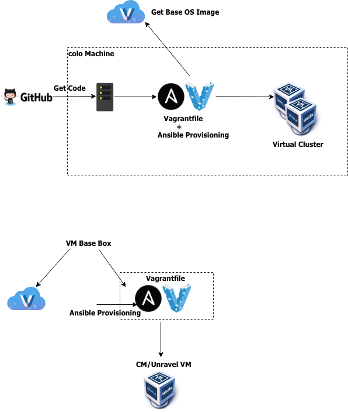

Ansible playbook for CDH single vm or mult-vm clusters

## High level Flow of Cluster Deployment


## Single/Muli node CDH cluster 


## Multinode cluster on single Host machine (private network)
Clone devops repo, this is required for cluster deployment python scripts and cloudera templates
```bash
git clone https://github.com/unraveldata-org/devops.git
```
or if you have already cloned devops in a different location, create 2 softlinks 
```bash
ln -s devops <devops repo path>
ln -s template <path to template folder>
```
Check the vagrantconfig.yml to tweak cpu, memory, hostname, ports and ip . 

Note that the ip in this case is private and can only be accessed from the Host machine.

Execute vagrant validate to check Vagrantfile syntax
```bash
vagrant validate
Vagrantfile validated successfully.
```
To create and deploy cluster , execute vagrant up 
```bash
vagrant up
==> tnode2: Running provisioner: shell...
    tnode2: Running: inline script
    tnode2: No Active Commands are running
    tnode2: Creating role ALERTPUBLISHER
    tnode2: Creating role EVENTSERVER
    tnode2: Creating role HOSTMONITOR
    tnode2: Creating role SERVICEMONITOR
    tnode2: mgmt-ALERTPUBLISHER-BASE
    tnode2: mgmt-EVENTSERVER-BASE
    tnode2: mgmt-HOSTMONITOR-BASE
    tnode2: mgmt-SERVICEMONITOR-BASE
    tnode2: Starting the CMS Service
    tnode2: No Active Commands are running
    tnode2: zookeeper -> STALE
    tnode2: ...restarting
    tnode2: http://10.0.15.3:7180/api/v12/clusters/cluster/services/zookeeper/commands/restart
    tnode2: hdfs -> STALE
    tnode2: ...restarting
    tnode2: http://10.0.15.3:7180/api/v12/clusters/cluster/services/hdfs/commands/restart
    tnode2: hbase -> STALE
    tnode2: ...restarting
    tnode2: http://10.0.15.3:7180/api/v12/clusters/cluster/services/hbase/commands/restart
    tnode2: yarn -> STALE
    tnode2: ...restarting
    tnode2: http://10.0.15.3:7180/api/v12/clusters/cluster/services/yarn/commands/restart
```
If the o/p ends with the above lines, the cluster is deployed and can be accessed by using the Public IP of the Host Machine http://<public_ip>:7180

## Multinode cluster on single Host machine (public network)


## Multinode cluster on multiple Host machines
You can use the Ansible playbook directly from any machine where Ansible is installed and deploy cluster, make sure to edit the <devops_repo>/cloudera_install/cloudera_install/hosts and add machine & key details 
```bash
ansible-playbook -i cloudera_install/cloudera_install/hosts cloudera_install/cloudera_install/cloudera.yml
```
The above playbook deploys all necessary packages required to Deploy a CDH Cluster 

To deploy and start the cluster , execute below commands
```bash
python cloudera/cluster.py --host <cm_ip> -t cloudera/template/clouera-single-node.json -a deploy-template -v <cm_version>
python cloudera/cluster.py --host <cm_ip> -a deploy-cms
```
